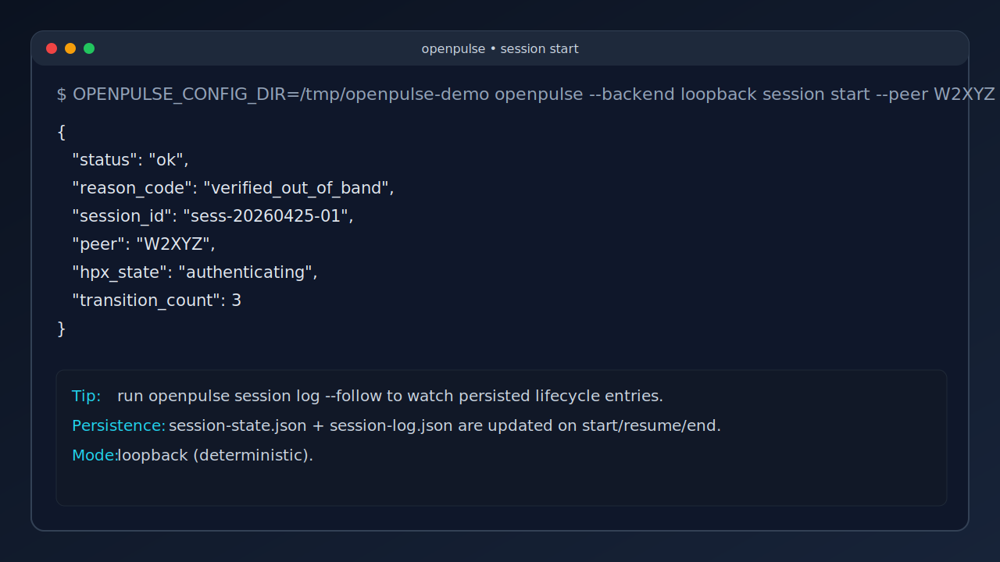
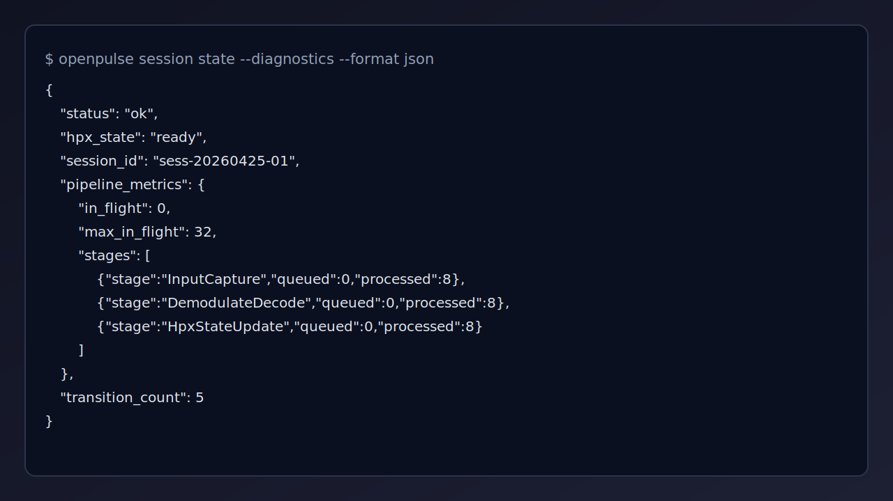
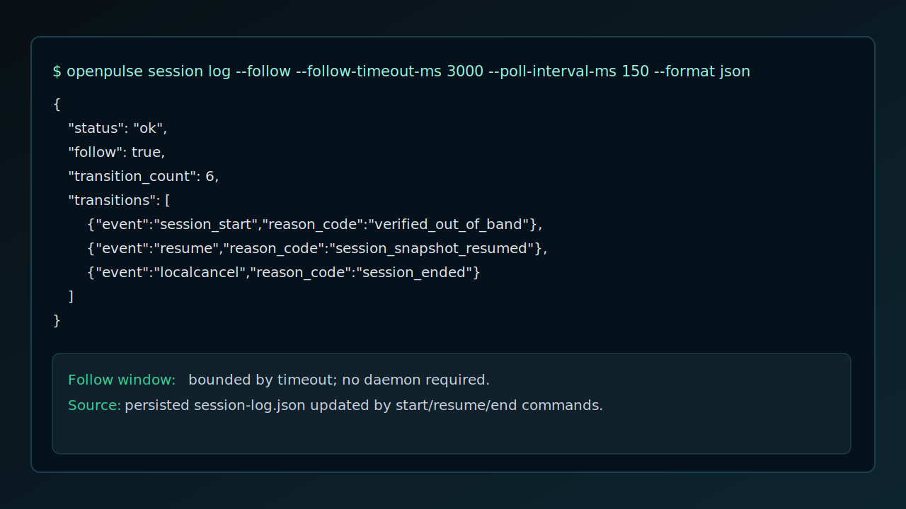

# OpenPulseHF

> Transmit data via HF – a plugin-based software modem written in Rust.

Project details, requirements, usage, and roadmap are maintained in the docs directory.

## TUI / CLI Screenshots

Session start:

Session diagnostics with pipeline metrics:

Session log follow (persisted lifecycle log):

## Documentation

- overview: [docs/overview.md](docs/overview.md)
- docs index: [docs/README.md](docs/README.md)
- architecture: [docs/architecture.md](docs/architecture.md)
- requirements: [docs/requirements.md](docs/requirements.md)
- CLI guide: [docs/cli-guide.md](docs/cli-guide.md)
- roadmap: [docs/roadmap.md](docs/roadmap.md)
- changelog: [docs/changelog.md](docs/changelog.md)
- release notes: [docs/releasenotes.md](docs/releasenotes.md)

## License

GNU General Public License v3.0 or later – see [LICENSE](LICENSE).

